# Code Review Graph

Visible generated graph for the current workspace. Regenerate with `npm run graph:update`.

## Summary

- Files scanned: 32
- Dependency edges: 82
- Frontend files: 30
- Backend files: 2

## Hotspots

- src/App.jsx (22 connections)
- src/components/ModernIcons.jsx (16 connections)
- src/context/GymDataContext.jsx (14 connections)
- src/context/AuthContext.jsx (9 connections)
- src/components/BrandMark.jsx (6 connections)
- src/pages/CheckoutPage.jsx (5 connections)
- src/pages/Dashboard.jsx (5 connections)
- src/components/Sidebar.jsx (4 connections)
- src/pages/AboutPage.jsx (4 connections)
- src/pages/BookingPage.jsx (4 connections)

## Graph

```mermaid
flowchart LR
  classDef pages fill:#dc26261f,stroke:#dc2626,color:#fff;
  classDef components fill:#3b82f61f,stroke:#3b82f6,color:#fff;
  classDef context fill:#22c55e1f,stroke:#22c55e,color:#fff;
  classDef shared fill:#f59e0b1f,stroke:#f59e0b,color:#fff;
  classDef backend fill:#a855f71f,stroke:#a855f7,color:#fff;
  classDef styles fill:#94a3b81f,stroke:#94a3b8,color:#fff;
  classDef other fill:#64748b1f,stroke:#64748b,color:#fff;

  server_index_js["server/index.js"]:::backend
  server_seed_js["server/seed.js"]:::backend
  src_App_jsx["src/App.jsx"]:::other
  src_components_BrandMark_jsx["src/components/BrandMark.jsx"]:::components
  src_components_Chatbot_jsx["src/components/Chatbot.jsx"]:::components
  src_components_DashboardLayout_jsx["src/components/DashboardLayout.jsx"]:::components
  src_components_GlobalBackButton_jsx["src/components/GlobalBackButton.jsx"]:::components
  src_components_ModernIcons_jsx["src/components/ModernIcons.jsx"]:::components
  src_components_PublicNavbar_jsx["src/components/PublicNavbar.jsx"]:::components
  src_components_Sidebar_jsx["src/components/Sidebar.jsx"]:::components
  src_components_TopBar_jsx["src/components/TopBar.jsx"]:::components
  src_context_AuthContext_jsx["src/context/AuthContext.jsx"]:::context
  src_context_GymDataContext_jsx["src/context/GymDataContext.jsx"]:::context
  src_lib_api_js["src/lib/api.js"]:::shared
  src_main_jsx["src/main.jsx"]:::other
  src_pages_AboutPage_jsx["src/pages/AboutPage.jsx"]:::pages
  src_pages_AttendanceTracking_jsx["src/pages/AttendanceTracking.jsx"]:::pages
  src_pages_BookingPage_jsx["src/pages/BookingPage.jsx"]:::pages
  src_pages_CheckoutPage_jsx["src/pages/CheckoutPage.jsx"]:::pages
  src_pages_ContactPage_jsx["src/pages/ContactPage.jsx"]:::pages
  src_pages_Dashboard_jsx["src/pages/Dashboard.jsx"]:::pages
  src_pages_LandingPage_jsx["src/pages/LandingPage.jsx"]:::pages
  src_pages_LoginPage_jsx["src/pages/LoginPage.jsx"]:::pages
  src_pages_Members_jsx["src/pages/Members.jsx"]:::pages
  src_pages_PaymentModule_jsx["src/pages/PaymentModule.jsx"]:::pages
  src_pages_Reports_jsx["src/pages/Reports.jsx"]:::pages
  src_pages_SignupPage_jsx["src/pages/SignupPage.jsx"]:::pages
  src_pages_SubscriptionPlans_jsx["src/pages/SubscriptionPlans.jsx"]:::pages
  src_pages_TrainerDetail_jsx["src/pages/TrainerDetail.jsx"]:::pages
  src_pages_TrainerScheduling_jsx["src/pages/TrainerScheduling.jsx"]:::pages
  src_pages_WorkoutDetail_jsx["src/pages/WorkoutDetail.jsx"]:::pages
  src_pages_WorkoutPlans_jsx["src/pages/WorkoutPlans.jsx"]:::pages

  src_App_jsx --> src_context_AuthContext_jsx
  src_App_jsx --> src_context_GymDataContext_jsx
  src_App_jsx --> src_components_DashboardLayout_jsx
  src_App_jsx --> src_components_Chatbot_jsx
  src_App_jsx --> src_pages_LandingPage_jsx
  src_App_jsx --> src_pages_LoginPage_jsx
  src_App_jsx --> src_pages_SignupPage_jsx
  src_App_jsx --> src_pages_Dashboard_jsx
  src_App_jsx --> src_pages_Members_jsx
  src_App_jsx --> src_pages_TrainerScheduling_jsx
  src_App_jsx --> src_pages_SubscriptionPlans_jsx
  src_App_jsx --> src_pages_AttendanceTracking_jsx
  src_App_jsx --> src_pages_PaymentModule_jsx
  src_App_jsx --> src_pages_WorkoutPlans_jsx
  src_App_jsx --> src_pages_Reports_jsx
  src_App_jsx --> src_pages_AboutPage_jsx
  src_App_jsx --> src_pages_ContactPage_jsx
  src_App_jsx --> src_pages_BookingPage_jsx
  src_App_jsx --> src_pages_CheckoutPage_jsx
  src_App_jsx --> src_pages_WorkoutDetail_jsx
  src_App_jsx --> src_pages_TrainerDetail_jsx
  src_components_Chatbot_jsx --> src_components_Chatbot_css
  src_components_Chatbot_jsx --> src_components_ModernIcons_jsx
  src_components_DashboardLayout_jsx --> src_components_Sidebar_jsx
  src_components_DashboardLayout_jsx --> src_components_TopBar_jsx
  src_components_GlobalBackButton_jsx --> src_context_AuthContext_jsx
  src_components_PublicNavbar_jsx --> src_components_BrandMark_jsx
  src_components_PublicNavbar_jsx --> src_components_PublicNavbar_css
  src_components_Sidebar_jsx --> src_context_AuthContext_jsx
  src_components_Sidebar_jsx --> src_components_BrandMark_jsx
  src_components_Sidebar_jsx --> src_components_Sidebar_css
  src_components_TopBar_jsx --> src_components_ModernIcons_jsx
  src_components_TopBar_jsx --> src_components_TopBar_css
  src_context_AuthContext_jsx --> src_lib_api_js
  src_context_GymDataContext_jsx --> src_lib_api_js
  src_main_jsx --> src_App_jsx
  src_main_jsx --> src_styles_global_css
  src_pages_AboutPage_jsx --> src_pages_AboutPage_css
  src_pages_AboutPage_jsx --> src_components_BrandMark_jsx
  src_pages_AboutPage_jsx --> src_components_ModernIcons_jsx
  src_pages_AttendanceTracking_jsx --> src_context_GymDataContext_jsx
  src_pages_AttendanceTracking_jsx --> src_components_ModernIcons_jsx
  src_pages_BookingPage_jsx --> src_pages_BookingPage_css
  src_pages_BookingPage_jsx --> src_context_GymDataContext_jsx
  src_pages_BookingPage_jsx --> src_components_ModernIcons_jsx
  src_pages_CheckoutPage_jsx --> src_pages_CheckoutPage_css
  src_pages_CheckoutPage_jsx --> src_context_GymDataContext_jsx
  src_pages_CheckoutPage_jsx --> src_context_AuthContext_jsx
  src_pages_CheckoutPage_jsx --> src_components_ModernIcons_jsx
  src_pages_ContactPage_jsx --> src_pages_ContactPage_css
  src_pages_ContactPage_jsx --> src_context_GymDataContext_jsx
  src_pages_ContactPage_jsx --> src_components_ModernIcons_jsx
  src_pages_Dashboard_jsx --> src_context_AuthContext_jsx
  src_pages_Dashboard_jsx --> src_context_GymDataContext_jsx
  src_pages_Dashboard_jsx --> src_components_ModernIcons_jsx
  src_pages_Dashboard_jsx --> src_pages_Dashboard_css
  src_pages_LandingPage_jsx --> src_components_BrandMark_jsx
  src_pages_LandingPage_jsx --> src_components_ModernIcons_jsx
  src_pages_LandingPage_jsx --> src_pages_LandingPage_css
  src_pages_LoginPage_jsx --> src_context_AuthContext_jsx
  src_pages_LoginPage_jsx --> src_components_BrandMark_jsx
  src_pages_LoginPage_jsx --> src_pages_AuthPages_css
  src_pages_Members_jsx --> src_context_GymDataContext_jsx
  src_pages_Members_jsx --> src_components_ModernIcons_jsx
  src_pages_PaymentModule_jsx --> src_context_GymDataContext_jsx
  src_pages_PaymentModule_jsx --> src_components_ModernIcons_jsx
  src_pages_Reports_jsx --> src_context_GymDataContext_jsx
  src_pages_Reports_jsx --> src_components_ModernIcons_jsx
  src_pages_SignupPage_jsx --> src_context_AuthContext_jsx
  src_pages_SignupPage_jsx --> src_components_BrandMark_jsx
  src_pages_SignupPage_jsx --> src_pages_AuthPages_css
  src_pages_SubscriptionPlans_jsx --> src_context_GymDataContext_jsx
  src_pages_SubscriptionPlans_jsx --> src_context_AuthContext_jsx
  src_pages_TrainerDetail_jsx --> src_pages_TrainerDetail_css
  src_pages_TrainerDetail_jsx --> src_context_GymDataContext_jsx
  src_pages_TrainerDetail_jsx --> src_components_ModernIcons_jsx
  src_pages_TrainerScheduling_jsx --> src_context_GymDataContext_jsx
  src_pages_TrainerScheduling_jsx --> src_components_ModernIcons_jsx
  src_pages_WorkoutDetail_jsx --> src_pages_WorkoutDetail_css
  src_pages_WorkoutDetail_jsx --> src_components_ModernIcons_jsx
  src_pages_WorkoutPlans_jsx --> src_context_GymDataContext_jsx
  src_pages_WorkoutPlans_jsx --> src_components_ModernIcons_jsx
```

## Update Notes

- Run `npm run graph:update` after small code changes to refresh this file.
- The graph is derived from import relationships in `src/` and `server/`.
